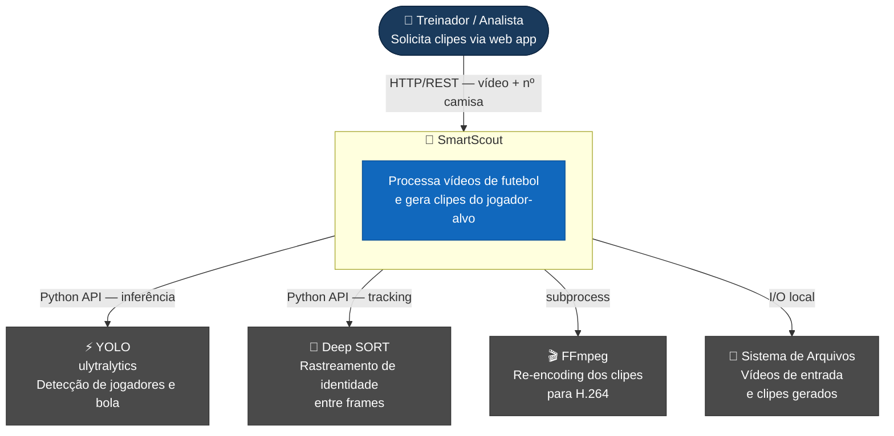

# C4 Context — SmartScout Video Pipeline

> **Nível 1 — Contexto do Sistema:** mostra quem usa o SmartScout e com quais sistemas externos ele se comunica.

| Elemento | Tipo | Descrição |
|----------|------|-----------|
| Treinador / Analista | Pessoa | Usuário final que solicita os clipes |
| SmartScout | Sistema | Pipeline de IA (este projeto) |
| YOLO | Sistema externo | Modelo de detecção de objetos |
| Deep SORT | Sistema externo | Algoritmo de rastreamento multi-objeto |
| FFmpeg | Sistema externo | Re-encoding de vídeo |
| Sistema de Arquivos | Sistema externo | Persistência de vídeos e clipes |
