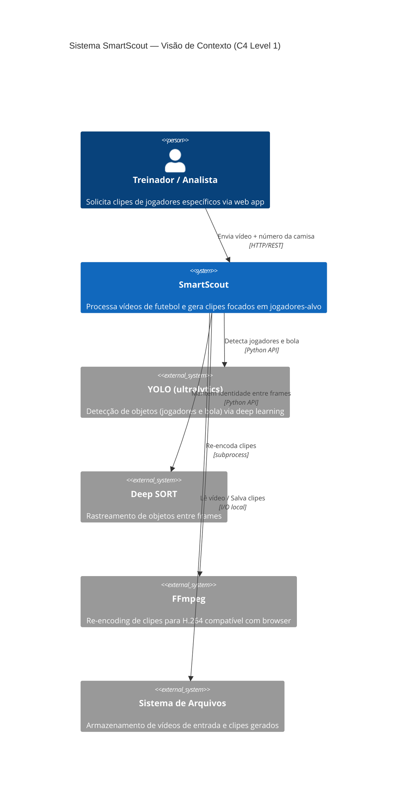

# C4 Context — SmartScout Video Pipeline

```mermaid
C4Context
    title Sistema SmartScout — Visão de Contexto (C4 Level 1)

    Person(usuario, "Treinador / Analista", "Solicita clipes de jogadores específicos via web app")

    System(smartscout, "SmartScout", "Processa vídeos de futebol e gera clipes focados em jogadores-alvo")

    System_Ext(yolo, "YOLO (ultralytics)", "Detecção de objetos (jogadores e bola) via deep learning")
    System_Ext(deepsort, "Deep SORT", "Rastreamento de objetos entre frames")
    System_Ext(ffmpeg, "FFmpeg", "Re-encoding de clipes para H.264 compatível com browser")
    System_Ext(storage, "Sistema de Arquivos", "Armazenamento de vídeos de entrada e clipes gerados")

    Rel(usuario, smartscout, "Envia vídeo + número da camisa", "HTTP/REST")
    Rel(smartscout, yolo, "Detecta jogadores e bola", "Python API")
    Rel(smartscout, deepsort, "Mantém identidade entre frames", "Python API")
    Rel(smartscout, ffmpeg, "Re-encoda clipes", "subprocess")
    Rel(smartscout, storage, "Lê vídeo / Salva clipes", "I/O local")
```
