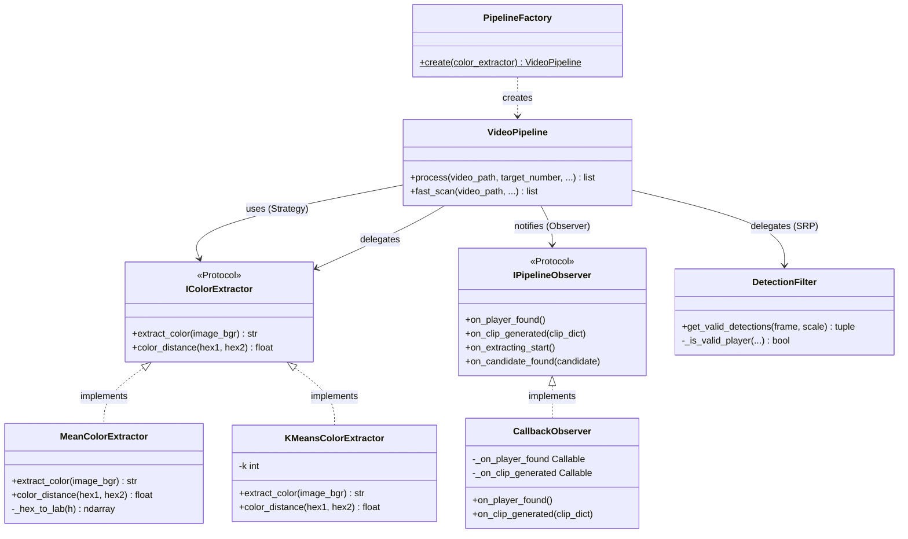

# Diagrama de Classes — Padrões GoF Aplicados

```mermaid
classDiagram
    %% ============ STRATEGY: Extração de Cor ============
    class IColorExtractor {
        <<Protocol>>
        +extract_color(image_bgr) str
        +color_distance(hex1, hex2) float
    }
    class MeanColorExtractor {
        +extract_color(image_bgr) str
        +color_distance(hex1, hex2) float
        -_hex_to_lab(h) ndarray
    }
    class KMeansColorExtractor {
        -k int
        +extract_color(image_bgr) str
        +color_distance(hex1, hex2) float
    }
    IColorExtractor <|.. MeanColorExtractor : implements
    IColorExtractor <|.. KMeansColorExtractor : implements
    VideoPipeline --> IColorExtractor : uses (Strategy)

    %% ============ FACTORY METHOD: Montagem do Pipeline ============
    class PipelineFactory {
        +create(color_extractor) VideoPipeline$
    }
    PipelineFactory ..> VideoPipeline : creates

    %% ============ OBSERVER: Ciclo de Vida ============
    class IPipelineObserver {
        <<Protocol>>
        +on_player_found()
        +on_clip_generated(clip_dict)
        +on_extracting_start()
        +on_candidate_found(candidate)
    }
    class CallbackObserver {
        -_on_player_found Callable
        -_on_clip_generated Callable
        +on_player_found()
        +on_clip_generated(clip_dict)
    }
    IPipelineObserver <|.. CallbackObserver : implements
    VideoPipeline --> IPipelineObserver : notifies (Observer)

    %% ============ FACADE + SRP ============
    class VideoPipeline {
        +process(video_path, target_number, ...) list
        +fast_scan(video_path, ...) list
    }
    class DetectionFilter {
        +get_valid_detections(frame, scale) tuple
        -_is_valid_player(...) bool
    }
    VideoPipeline --> DetectionFilter : delegates (SRP)
    VideoPipeline --> IColorExtractor : delegates
```
