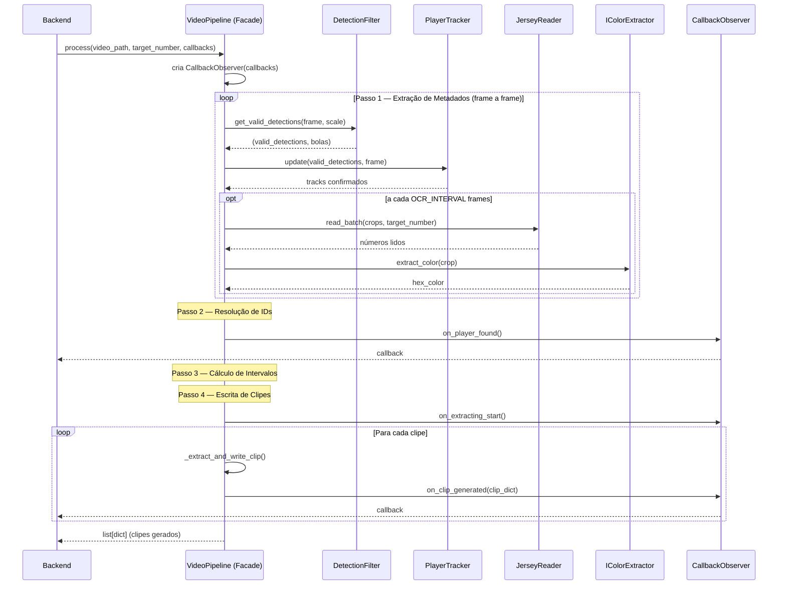

# Diagrama de Sequência — `VideoPipeline.process()`

```mermaid
sequenceDiagram
    participant Backend
    participant Pipeline as VideoPipeline (Facade)
    participant Filter as DetectionFilter
    participant Tracker as PlayerTracker
    participant OCR as JerseyReader
    participant Color as IColorExtractor
    participant Observer as CallbackObserver

    Backend->>Pipeline: process(video_path, target_number, callbacks)
    Pipeline->>Pipeline: cria CallbackObserver(callbacks)

    loop Passo 1 — Extração de Metadados (frame a frame)
        Pipeline->>Filter: get_valid_detections(frame, scale)
        Filter-->>Pipeline: (valid_detections, bolas)
        Pipeline->>Tracker: update(valid_detections, frame)
        Tracker-->>Pipeline: tracks confirmados
        opt a cada OCR_INTERVAL frames
            Pipeline->>OCR: read_batch(crops, target_number)
            OCR-->>Pipeline: números lidos
            Pipeline->>Color: extract_color(crop)
            Color-->>Pipeline: hex_color
        end
    end

    Note over Pipeline: Passo 2 — Resolução de IDs
    Pipeline->>Observer: on_player_found()
    Observer-->>Backend: callback

    Note over Pipeline: Passo 3 — Cálculo de Intervalos

    Note over Pipeline: Passo 4 — Escrita de Clipes
    Pipeline->>Observer: on_extracting_start()
    loop Para cada clipe
        Pipeline->>Pipeline: _extract_and_write_clip()
        Pipeline->>Observer: on_clip_generated(clip_dict)
        Observer-->>Backend: callback
    end

    Pipeline-->>Backend: list[dict] (clipes gerados)
```
